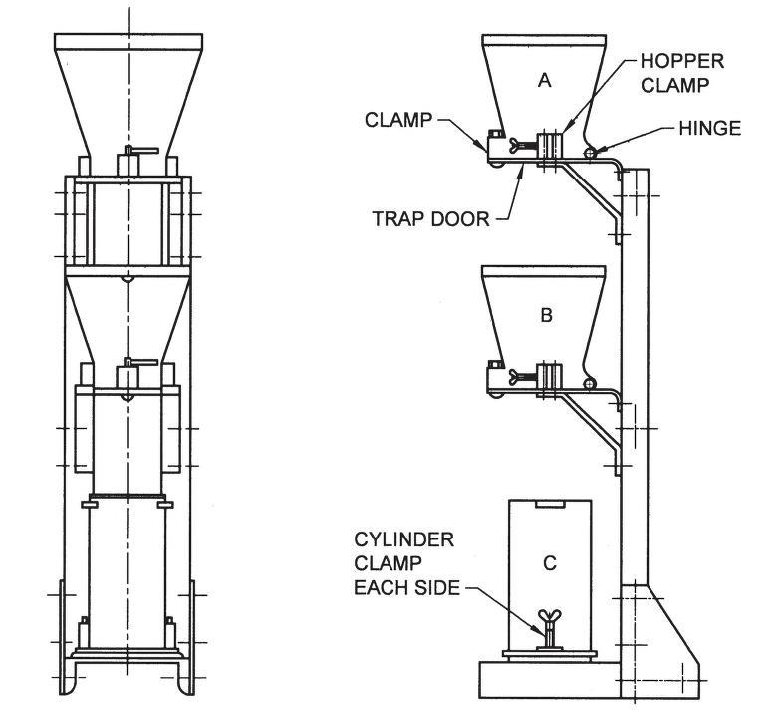

## Theory

As per IS 1199, workability is defined as the property of freshly mixed concrete that determines the ease and homogeneity with which it can be mixed, placed, compacted, and finished. Similarly, ASTM C125 defines workability as the effort required to manipulate a freshly mixed quantity of concrete with minimum loss of homogeneity. The term *manipulate* refers to early-age operations such as placing, compacting, and finishing.

The effort required to place concrete largely depends on the total work needed to initiate and sustain flow. This, in turn, is influenced by:

- The rheological properties of the cement paste (acting as a lubricant),
- Internal friction between aggregate particles, and
- External friction between the concrete and formwork surfaces.

Workability is a critical property in concrete technology as it directly affects constructability. It is a composite characteristic comprising two primary components:

1. **Consistency** – representing ease of flow or mobility, and
2. **Cohesiveness** – indicating stability against segregation and bleeding.

The Compaction Factor Test is used to determine the consistency of fresh concrete, particularly for low-workability or stiff mixes where the slump test is not effective. The compaction factor test measures the consistency of concrete by assessing its ability to compact under a standard amount of energy. Based on the principle that higher consistency results in easier compaction, it calculates the ratio of the weight of partially compacted concrete to fully compacted concrete. In this test, concrete is allowed to fall freely under gravity from an upper hopper to a lower hopper and then into a cylinder, resulting in partial compaction due to the absence of external effort. When concrete falls freely, it does not achieve full compaction due to internal friction and lack of external energy, and the denser the concrete after free fall, the higher its workability. Therefore, a higher compaction factor (approximately 0.9–0.95) indicates high workability, while a lower value (approximately 0.7–0.8) indicates low workability. Workability is related to how easily concrete can flow and compact without segregation, and this test simulates actual placing conditions where concrete falls under its own weight. Hence, it provides a more precise measurement than the slump test for dry mixes and is especially useful in applications such as road construction and mass concreting. The test is designed primarily for use in the laboratory, but if circumstances permit, it may also be used in the field.

### Apparatus

A diagram of the apparatus is shown in Fig. 1. It consists of two conical hoppers, designated as A (upper hopper) and B (lower hopper), mounted vertically above a cylindrical mould C. The hopper and cylinder are of rigid construction, true to shape, and smooth on the inside to ensure proper flow of concrete. They are preferably made of cast brass or bronze, although stout sheet brass or steel may also be used, provided that the inner surfaces, especially at joints, are smooth and flush. The lower ends of both hoppers are fitted with tightly closing hinged trap-doors equipped with quick-release catches, and metal plates of about 3 mm thickness are suitable for these doors. The entire assembly is supported on a rigid frame that holds the hoppers and cylinder firmly in their specified relative positions, while also allowing easy detachment of each component.

The apparatus is accompanied by standard tools including two trowels, a scoop of adequate size, a tamping rod made of steel (16 ± 1 mm diameter, 600 ± 5 mm length, with rounded ends), and a weighing balance capable of measuring up to 50 kg with an accuracy of 10 g. The essential dimensions are as follows: the upper hopper (A) has a top internal diameter of 250 mm, bottom diameter of 125 mm, and height of 280 mm; the lower hopper (B) has a top diameter of 230 mm, bottom diameter of 125 mm, and height of 230 mm; and the cylinder (C) has an internal diameter of 150 mm and height of 300 mm. The vertical distance between the bottom of the upper hopper and the top of the lower hopper is 200 mm, and similarly, the distance between the bottom of the lower hopper and the top of the cylinder is also 200 mm.

<!-- Image placeholder for Fig. 1: Compaction Factor Apparatus -->

**Fig. 1: COMPACTION FACTOR APPARATUS (IS 1199)**

